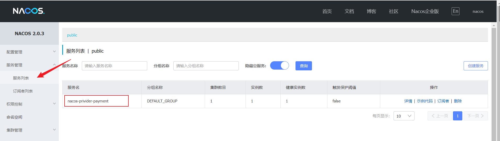

```
springcloud：2020.0.3

SpringcloudAlibaba：2.2.6.RELEASE

Springboot：2.4.13
```

官网：https://nacos.io/zh-cn/

启动：bin目录下执行命令startup.cmd   <mark>（默认是集群版本set MODE="cluster"，初次启动需要改为单机版本set </mark><mark>MODE="standalone"，在startup.cmd文件中修改）</mark>

默认端口号：8848  访问路径http://localhost:8848/nacos  用户名密码默认为nacos



### Nacos注册中心

nacos作为服务注册中心时，当注册进的服务down后，会在短时间内将该服务从nacos移除，而不是和eureka那样，继续保留

```yml
spring:
  cloud:
    nacos:
      discovery:
        server-addr: localhost:8848  #nacos作为服务注册中心的地址
```

在application.yml中配置nacos作为服务注册的地址，即可将自身服务注册进nacos

### Nacos负载均衡

nacos天生继承了netflex-ribbon，因此支持负载均衡

访问服务的路径建议配置在application文件中，实现代码与配置分离

```yml
service-url:
  nacos-user-service: http://nacos-privider-payment
```

将RestTemplate注册进spring容器...

还是openfeign比较好用（各人观点）

### Nacos CAP原则

nacos支持AP或CP，可以在这两个状态中切换，其中C是指所有的节点在统一时间看到的数据是一致的（一致性），A是指所有的请求都会收到相应（高可用）

P是指分区容错性，系统中任意的信息丢失或失败都不会影响系统的继续运行，是一个西永最基本的原则

切换服务：

```
curl -X POST '$NACOS_SERVER:8848/nacos/v1/ns/operator/switches?entry=serverMode&value=CP'
```

### Nacos配置中心

#### 基础使用

**这里需要注意，spring cloud2020禁用了bootstrap，使用bootstrap需要自己在pom引入spring-cloud-starter-bootstrap**


dataId的设置公式为：

```
${prefix}-${spring.profiles.active}.${file-extension}
```

prefix表示前缀，默认为spring.application.name的值，也可以通过spring.cloud.nacos.config.prefix配置，spring.profiles.active为在application中配置的当前服务的环境，file-extension为文件扩展名

```yml
spring:
  cloud:
    nacos:
      config:
        server-addr: localhost:8848  #nacos作为配置中心的地址
        file-extension: ymal  #配置的格式为yaml
```

nacos的配置是支持动态刷新的，在nacos中修改了配置后，其他服务可以立即获取到而不用手动刷新

#### 命名空间，分组

nacos使用命名空间和分组进行环境隔离或者服务的隔离

**分组**


```yml
spring:
  cloud:
    nacos:
      config:
        server-addr: localhost:8848  #nacos作为配置中心的地址
        file-extension: ymal  #配置的格式为yaml
        group: TEST_GROUP  #分组
```

**命名空间**


每一个命名空间创建的时候，都会生成一个ID，在配置命名空间的时候，配置的就是这个ID

```yml
spring:
  cloud:
    nacos:
      config:
        server-addr: localhost:8848  #nacos作为配置中心的地址
        file-extension: yaml  #配置的格式为yaml
        group: TEST_GROUP  #分组
        namespace: 2d6b642a-25b6-4b50-886d-0e44879f0bed  #test命名空间ID
```

### Nacos持久化

执行nacos安装目录下nacos\conf中nacos-mysql.sql脚本，修改application.properties配置，添加:

```properties
spring.datasource.platform=musql
db.num=1
db.url.0=jdbc:mysql://127.0.0.1:3306/nacos_config?characterEncoding=utf8&connectTimeout=1000&socketTimeout=3000&autoReconnect=true&serverTimezone=UTC
db.user=root
db.password=root
```

PS：注意下db.url后的参数名和取值，这里配置的问题很容易导致启动不成功

### Nacos搭建集群

官方提供了docker安装

https://www.imooc.com/article/288153 (这里我在搭建的时候不知道怎么回事，nacos最多只能启动两个，第三个必定会出现Address already in use: bind的错误)

nginx.conf

    upstream cluster{
            server 127.0.0.1:8847 weight=2;
            server 127.0.0.1:8848 weight=2;
            server 127.0.0.1:8849 weight=2;
        }
    server{
        listen 8888;
        server_name localhost;
        location /{
            proxy_pass http://cluster/nacos/;
        }
    }