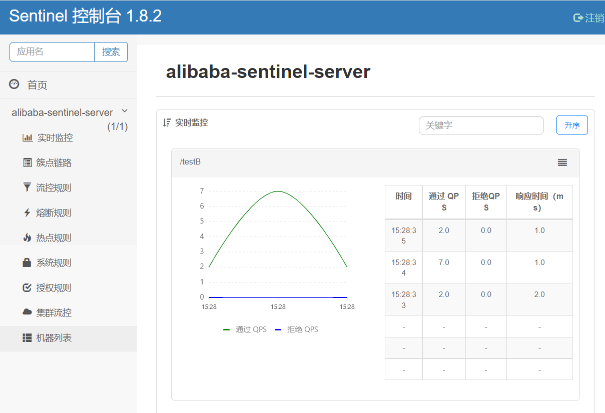
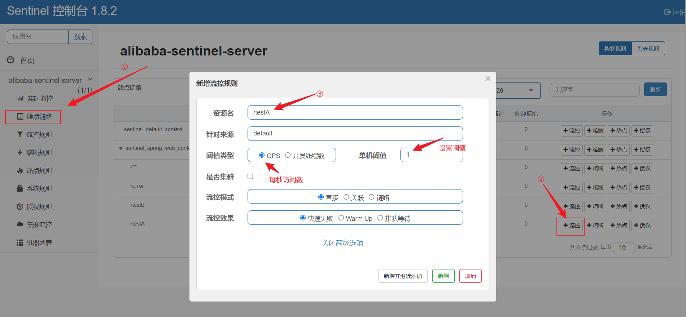
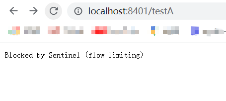
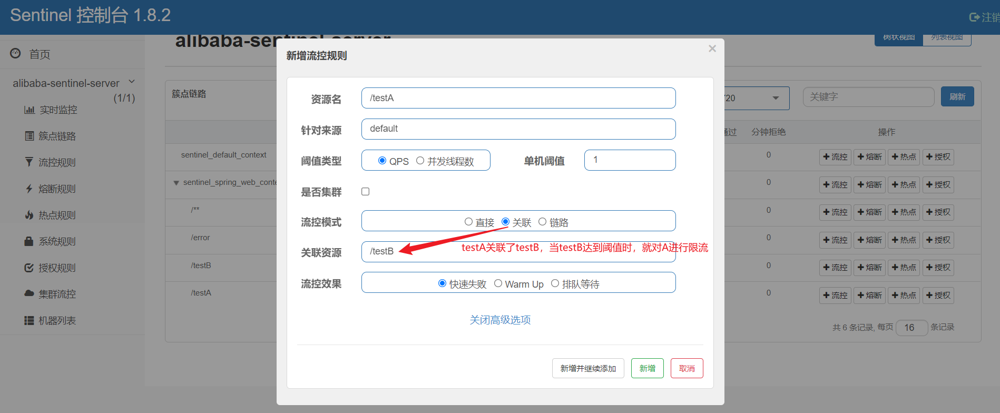
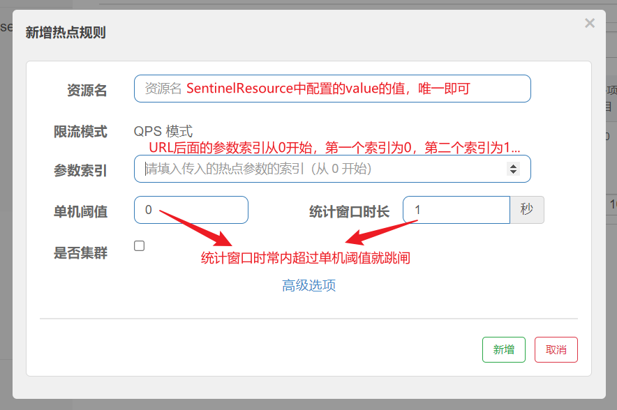

# Sentinel

sentinel和nacos一样，在服务停止后，立即注销服务

pom

```xml
<!--alibaba sentinel-->
<dependency>
    <groupId>com.alibaba.cloud</groupId>
    <artifactId>spring-cloud-starter-alibaba-sentinel</artifactId>
</dependency>
<!--持久化-->
<dependency>
    <groupId>com.alibaba.csp</groupId>
    <artifactId>sentinel-datasource-nacos</artifactId>
</dependency>
<!--openfeign-->
<dependency>
    <groupId>org.springframework.cloud</groupId>
    <artifactId>spring-cloud-starter-openfeign</artifactId>
</dependency>
```

### Sentinel基础使用

sentinel默认端口号为8080，启动时执行jar包即可启动，访问地址为localhost:8080，默认用户名密码为sentinel，sentinel



applicaltion.yml

```yml
spring:
  cloud:
    sentinel:
      transport:
        #配置sentinel dashboard地址，当前的服务8401会被8080监控
        dashboard: localhost:8080
        #默认8719端口，如果端口号被占用，自动从8719依次+1扫描，知道找到可用端口号
        port: 8719
```

sentinel自身为懒加载机制，当服务配置了sentinel监控，但该服务从未被调用过时，sentinel仪表盘不显示该服务，直到服务被调用

### Sentinel流控

**系统默认**（直接在页面配置，因此错误返回由系统提供，没有特定的fallback方法）



上图配置表示：每秒只能访问一次，出现大于一次的访问时，直接失败



如果想要自己指定回调方法，需要配合@SentinelResource使用，在该注解的blockHandler方法中指定回调方法。没有指定是用系统默认的，即Blocked by Sentinel（flow limiting）

blockHandler不负责管理java运行时异常，当代码中出现运行时异常时，不会进入回调返回发，blockHandler只负责管理在sentinel页面上配置的流控异常。

**关联**

这里配置了testA关联testB，阈值类型是对被关联对象的限制，即对testB的限制，当testB达到阈值时，不对testB进行限流控制，而对testA进行限流

场景：订单服务关联支付服务，若支付服务达到阈值，对订单服务进行限流



**wormup**

场景：某系统平时无人问津，等到举行某活动时，突然有大批量的访问，系统可能会扛不住压力，因此需要预热，即warmup

预热初始访问量往往从threshhold/3开始，即当设置了QPS为10时，初始访问量阈值为3，即每秒访问量达到3的时候就开始限流，等到n秒后再升到10，n为设置的预热时常。

**排队等待**

排队等待时，阈值的类型必须为QPS，否则无效。设置为排队等待后，所有的请求匀速排队，串行处理，直到等待的时候达到超时时长后，失败重试。

场景：在某一时刻有大量的请求，接下来立刻出现一段时间的空缺，设置排队等待可以让系统在接下来的空闲时间内处理刚刚的大量未处理的剩余请求，而不是在大量请求到来时直接拒绝。

### sentinel熔断降级

sentinel的熔断降级和hystrix非常相似。

**最大RT**：慢调用比例，当请求响应时间超出设置的阈值，统一认为是慢调用，当请求的数据大于设置的最小请求数据，且慢调用的比例大于设置的比例，就会触发熔断，经过熔断时长后会进入探测阶段（半开），在接下来的请求响应时间内若小于慢调用的相关阈值则结束熔断。（在sentinel1.8之后引入了半开）

**异常比例**：单位统计时常内达到最小请求次数，且异常比例数超过了设置的阈值，则熔断。熔断时长后进入半开状态探测...

**异常数**：单位统计时常内达到最小请求次数，且异常数超过了设置的阈值，则熔断。...

### sentinel热点规则

配置的热点规则在每次服务重启后会重置，下一次需要重新配置。。。是因为我没做持久化吗。。。



@SentinelResource注解类似于hystrix中的@HystrixCommand注解

value属性对应页面配置中的资源名，blockHandler类似于hystrix中的fall_back回调方法，**SentinelResource从逻辑上一定要带上blockHandler方法，否则放出错的时候，错误将直接返回到页面。**

还可以对特定的参数设置特定的值...详见官网吧...

### 客户自定义限流全局处理

前面介绍的限流的回调方法存在的问题：①系统提供的方法不仅没有去标签化，而且还体现不出业务需求；②每一个业务方法都需要一个回调方法，导致代码膨胀；③回调方法和业务代码耦合

这里可以重新定义一个类，专门定义回调方法，并配合@SentinelResource注解的blockHandlerClass属性和blockHandler属性，表示使用blockHandlerClass中的blockHandler方法作为回调方法。（blockHandler不负责管理java运行时异常，当代码中出现运行时异常时，不会进入回调返回发，blockHandler只负责管理在sentinel页面上配置的流控。）

```java
@SentinelResource(value = "customerBlockHandler", blockHandlerClass = CustomerBlockHandler.class, blockHandler = "handlerException2")
```

这里在sentinel界面上配置流控的时候，需要使用value去配置，直接使用URL配置还是会使用系统默认的回调方法。（原因好像是sentinel在某个版本后默认收敛所有的URL入口，直接在页面配置是不生效的，需要在applicaltion中配置打开URL）-----好像不太对，加上这个配置后，sentinel不监控URL，只对配置了@SentinelResource.value的进行监控

```yml
spring:
   cloud:
     sentinel:
       filter:
         # 关闭链路收敛使链路收敛能够生效
         enabled: false
```

### sentinel异常处理

前面blockHandler定义的回调方法只能处理页面配置的异常，当出现java运行时异常blockhandler方法是不处理的。fallback会处理java运行时异常：

```java
 @SentinelResource(value = "fallback",fallbackClass = FallbackHandler.class,fallback = "handlerFallback")
```

fallBack用法和Block几乎一样，由fallbackClass定义回调方法的类，fallback定义类中的回调方法。

fallback和blockHandler可以同时定义，当出现java运行时异常，会调用fallback回调函数，出现sentinel配置异常，调用blockhandler定义的回调方法。

\* **fallback回调方法和blockHandler回调方法定义的异常把不同，fallback回调方法上定义的参数类型为Throwable，blockHandler回调方法上定义的参数的类型为BlockException**

fallback:

```java
 public static CommonResult fallBackHandler(Long id,Throwable exception){
        Payment payment = new Payment(id, null);
        CommonResult<Payment> paymentCommonResult = new CommonResult<>(444, "兜底异常HandlerFallBack，Exception：" + exception.getMessage(), payment);
        return paymentCommonResult;
    }
```

blockhandler:

```java
public CommonResult handlerFallback(@PathVariable Long id, BlockException exception){
        Payment payment = new Payment(id, null);
        return new CommonResult(444,"blockhandler："+exception.getMessage(),payment);
    }
```

处理之外，sentinel还提供了异常忽略，即@SentinelResource注解的exceptionsToIgnore属性，该属性定义异常的类型，放方法中出现该类型是，不调用回调方法。

### 引入Feign

需要首先激活sentinel对feign的支持

applicaltion.yml

```yml
feign:
  sentinel:
    enabled: true  #激活sentinel对feign的支持
```

使用几乎和hystrix的使用方法一模一样，定义service调用其他的服务，fallback绑定回调方法类

```java
@Service
@FeignClient(value = "cloud-privider-payment",fallback = PaymentServiceImpl.class)
public interface IPaymentService {
    @GetMapping("/getById/{id}")
    public CommonResult<Payment> getById(@PathVariable("id")Long id);
}
```

定义回调方法类，实现该service接口，当出现异常时，会进入对应的回调方法。

```java
@Component
public class PaymentServiceImpl implements IPaymentService {

    @Override
    public CommonResult<Payment> getById(Long id) {
        Payment payment = new Payment(id, null);
        CommonResult<Payment> paymentCommonResult = new CommonResult<>(444, "PaymentServiceImpl异常处理。", payment);
        return paymentCommonResult;
    }
}
```


### sentinel持久化

sentinel默认是没有持久化，在每一次服务重启后，之前所配置的信息全部没有了，需要重新再配置，因此可以将sentinel持久化进nacos中。

添加依赖包：

```xml
<!--持久化，将sentinel持久化进nacos-->
<dependency>
    <groupId>com.alibaba.csp</groupId>
    <artifactId>sentinel-datasource-nacos</artifactId>
</dependency>
```

为sentinel添加数据源的配置：

```yml
spring:
  cloud:
    sentinel:
      datasource:
        ds1:
          nacos:
            server-addr: localhost:8848
            dataId: alibaba-sentinel-server
            groupId: DEFAULT_GROUP
            data-type: json
            rule-type: flow
```

在nacos中添加配置，格式为json

```json
[
    {
        "resource":"",  //资源名称，填写url
        "limitApp":"",  //来源应用
        "grade":1,  //阈值类型，0表示线程数，1表示QPS
        "count":1,  //单机阈值
        "strategy":0,   //流控模式，0表示直接，1表示关联，2表示链路
        "controlBehavior":0,  //流控效果，0表示快速失败，1表示warm up，2表示排队等待
        "clusterMode":false  //是否集群
    }
]
```

这样服务在重启之后，sentinel中也有配置。（在服务关闭的时候，是没有的），不过这种持久化的方式有一些不够人性化，当有很多URL需要监控并且持久化的话，需要为每一个URL都编写一个json串，而且比较容易出错。。。。
